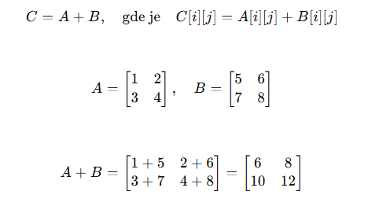
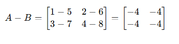
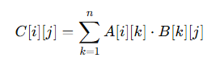
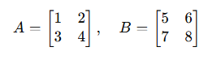
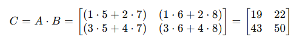

Матрице у програмирању
============================

Матрице у програмирању представљају структуре података које нам омогућавају да чувамо и организујемо информације у облику табеле. 
Табела се састоји од **редова** и **колона**, што значи да је матрица дводимензионална, за разлику од једнодимензионалних структура попут листи или низова.

На пример, замислите табелу оцена у разреду где сваки ред представља једног ученика, а свака колона одговара различитом предмету. 
Матрице су изузетно корисне када желимо да 
организујемо податке на овај начин.

У програмирању, матрице најчешће реализујемо коришћењем **листа у листи**. Сваки ред матрице је једна листа, а сви ти редови заједно чине матрицу. 
Ево једноставног примера 
у програмском језику Пајтон:

.. code-block:: python

   # Матрица оцена
   ocene = [
       [5, 4, 3],  # Оцене првог ученика
       [4, 5, 5],  # Оцене другог ученика
       [3, 4, 4]   # Оцене трећег ученика
   ]

У овом примеру, матрица "ocene" има 3 реда и 3 колоне. Оцене сваког ученика организоване су у једном реду.

.. questionnote:: 
    
    Зашто су матрице важне?

Матрице су веома моћан алат у програмирању јер омогућавају рад са подацима који имају логичку структуру. Ево неких примера примене матрица:

1. **Чување табеларних података:** Матрице се користе за складиштење података попут оцена ученика, температура у градовима или резултата анкета.
2. **Рачунарска графика:** У графици, матрице се користе за трансформације слика, као што су ротирање, увећање или померање.
3. **Наука и инжењерство:** Матрице се често користе у симулацијама, анализи података и решавању сложених математичких проблема.
4. **Игре:** У играма, матрице могу представљати табле, мапе или позиције објеката.

.. questionnote:: 
    
    Како приступамо подацима у матрицама?

У матрицама, сваки елемент има своју позицију, која је дефинисана редом и колоном. Индекси у програмирању почињу од 0. На пример:

.. code-block:: python
     
   # Приступање елементима матрице
   ocene = [
       [5, 4, 3],  # Ред 0
       [4, 5, 5],  # Ред 1
       [3, 4, 4]   # Ред 2
   ]

   # Испис оцене из другог реда и треће колоне
   print(ocene[1][2])  # Резултат је 5

У овом примеру, "ocene[1][2]" значи: пронађи елемент у реду 1 (други ред) и колони 2 (трећа колона).

.. infonote:: Основне операције са матрицама

    1. Сабирање и одузимање матрица: Матрице могу бити сабране или одузете ако имају исте димензије, тако што сабирамо или одузимамо 
	елементе на истим позицијама.

    

    2. Множење матрица: Ово је мало сложенија операција где се сваки елемент резултирајуће матрице израчунава множењем и сабирањем 
	одговарајућих редова и колона.

    

    3. Транспоновање: Замена редова и колона у матрици.

 

Матрице у програмирању су основни алат за организовање и манипулацију подацима. Њихово разумевање је важно за решавање проблема у различитим областима, од науке до видео-игара. 
Са матрицама, ученици ће научити како да примене знања из математике на практичне проблеме у програмирању.

1. **Дефинисање матрице 2x3**

.. code-block:: python
   
   # Пример матрице 2x3 у Python-у
   A = [
       [1, 2, 3],
       [4, 5, 6]
   ]

Ова матрица има 2 реда и 3 колоне.

2. **Како приступити елементима матрице?**

Елементима матрице може се приступити тако што се користи индекс реда и индекс колоне. Индекси увек почињу са 0.

Пример:

.. code-block:: python
   
   # Приступање елементу матрице
   A = [
       [1, 2, 3],
       [4, 5, 6]
   ]

   print(A[0][1])  # Исписује 2 (први ред, друга колона)

3. **Сабирање и одузимање матрица у програмима**

Сабирање и одузимање матрица у програмима подразумева да се елементи две матрице са истим димензијама додају или одузимају по одговарајућим позицијама.

Сабирање, одузимање и множење матрица су основне операције у линеарној алгебри које се користе за решавање различитих математичких и практичних проблема. 
Ево детаљнијег објашњења за сваку операцију:

**Пример сабирања матрица:**

Сабирање матрица могуће је само ако матрице имају исте димензије (исти број редова и колона).

Правило: Ако су A и B матрице димензија m×n, њихово сабирање се врши тако што се сабирају одговарајући елементи:

	

.. code-block:: python
   
   # Сабирање две матрице
   A = [
       [1, 2, 3],
       [4, 5, 6]
   ]

   B = [
       [7, 8, 9],
       [10, 11, 12]
   ]

   # Сабирање
   C = [
       [A[i][j] + B[i][j] for j in range(len(A[0]))]  # Сваки елемент из матрица A и B се сабира
       for i in range(len(A))
   ]

   print(C)  # Исписује [[8, 10, 12], [14, 16, 18]]

**Пример одузимања матрица:**

Одузимање матрица функционише исто као сабирање, али се одговарајући елементи одузимају. Димензије матрица такође морају бити исте.
Ако су A и B матрице димензија m×n, њихово одузимање се врши тако што се одговарајући елементи одузимају:

.. image:: ../../_images/oduzimanjematrica1.png
    :width: 400 px

.. code-block:: python
   
   
   # Одузимање две матрице
   A = [
       [5, 7],
       [10, 12]
   ]

   B = [
       [2, 3],
       [4, 5]
   ]

   # Одузимање
   C = [
       [A[i][j] - B[i][j] for j in range(len(A[0]))]  # Сваки елемент из матрица A и B се одузима
       for i in range(len(A))
   ]

   print(C)  # Исписује [[3, 4], [6, 7]]

4. **Множење матрица у програмима**

Множење матрица је операција која захтева да број колона прве матрице одговара броју редова друге матрице. Резултат је нова матрица која има број 
редова прве матрице и број колона друге матрице.
Ако је A матрица димензија m×n, а B матрица димензија n×p, њихово множење C=A⋅B је матрица димензија m×p, где сваки елемент 𝐶[𝑖][𝑗]C[i][j] 
дефинише сума производа одговарајућих елемената из i-тог реда матрице A и j-те колоне матрице B:

Пример множења:

.. code-block:: python
   
   # Множење две матрице
   A = [
       [1, 2],
       [3, 4] 
   ]

   B = [
       [5, 6],
       [7, 8]
   ]

   # Множење
   C = [
       [sum(A[i][k] * B[k][j] for k in range(len(B))) for j in range(len(B[0]))]  # Произвођење редова и колона
       for i in range(len(A))
   ]

   print(C)  # Исписује [[19, 22], [43, 50]]
