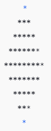

Вежбање
==============

.. questionnote ::

   Napisati funkciju zapis(x, y) koja proverava da li se brojevi x i y zapisuju pomoću
   istih cifara. Funkcija treba da vrati jedinicu ako je uslov ispunjen, a nulu inače.
   Napisati program koji učitava dva cela broja i ispisuje da li je za njih pomenuti
   uslov ispunjen ili ne.
   
   

.. activecode:: vezbanje8_109
   :coach:

   def zapis(x, y):
       # Pretvaramo brojeve u string i sortiramo cifre
       if sorted(str(x)) == sorted(str(y)):
           return 1  # Ako su cifre iste, vraća 1
       return 0  # Inače vraća 0

   # Program koji učitava dva broja i proverava uslov
   x = int(input("Unesite prvi broj (x): "))
   y = int(input("Unesite drugi broj (y): "))
   rezultat = zapis(x, y)

   if rezultat == 1:
       print("Brojevi", x, "i", y, "se mogu zapisati pomoću istih cifara.")
   else:
       print("Brojevi", x, "i", y, "ne mogu da se zapisu pomoću istih cifara.")

Objašnjenje:

1. Funkcija `zapis(x, y)` pretvara oba broja \( x \) i \( y \) u stringove kako bi im se mogla pristupiti svaka cifra.

2. Koristi se funkcija `sorted()` za sortiranje cifara oba broja.

3. Ako su sortirane cifre oba broja iste, funkcija vraća \( 1 \), što znači da brojevi koriste iste cifre. U suprotnom, vraća \( 0 \).

4. Program zatim učitava dva broja i ispisuje odgovarajući rezultat na osnovu funkcije `zapis(x, y)`.   

.. questionnote ::

   Napisati funkciju par_nepar(n) koja ispituje da li su cifre datog celog broja
   naizmenično parne i neparne. Napisati program koji učitava ceo broj i ispisuje da li on ispunjava pomenuti uslov
   ili ne.
   

Funkcija `par_nepar(n)`

.. activecode:: vezbanje8_110
   :coach:

   def par_nepar(n):
       cifre = str(abs(n))  # Pretvaramo broj u string (koristimo abs da se rešimo negativnog signala)
    
       # Proveravamo svaku cifru u nizu
       for i in range(1, len(cifre)):
           # Ako je parni indeks (sudeći od 0), proveravamo da li su cifre naizmenično parne i neparne
           if (int(cifre[i-1]) % 2 == int(cifre[i]) % 2): 
               return 0  # Ako dve uzastopne cifre nisu naizmenično parne i neparne, vraćamo 0
       return 1  # Ako su sve cifre naizmenično parne i neparne, vraćamo 1

   # Program koji učitava broj i proverava uslov
   n = int(input("Unesite ceo broj: "))
   rezultat = par_nepar(n)

   if rezultat == 1:
       print("Cifre broja", n, "su naizmenično parne i neparne.")  
   else:
       print("Cifre broja", n, "nisu naizmenično parne i neparne.")

Objašnjenje:

1. Funkcija `par_nepar(n)` prvo koristi `str(abs(n))` kako bi broj pretvorila u string i ignorisala negativni znak ako postoji (kako bi se izbegle greške sa negativnim brojevima)

2. Zatim proverava svaku cifru u stringu. Ako se dve uzastopne cifre (u paru) ponašaju na isti način (obje su parne ili obe su neparne), vraća \( 0 \), što znači da cifre nisu 
naizmenično parne i neparne

3. Ako su sve cifre naizmenično parne i neparne, funkcija vraća \( 1 \)

4. Program koristi ovu funkciju da proveri uneti broj i ispiše odgovarajući rezultat

   
   
   
.. questionnote ::

 
   Napisati funkciju romb(n) koja iscrtava romb čija je stranica dužine n. Napisati program koji učitava pozitivan broj i iscrtava odgovarajuću sliku. U slučaju
   neispravnog unosa, ispisati odgovarajuću poruku o grešci.   
 

.. activecode:: vezbanje8_111
   :coach:

   def romb(n):
       if n <= 0:
           print("Greška: Broj mora biti pozitivan.")
           return
    
       # Gornji deo romba
       for i in range(n):
           # Ispis praznog prostora i zvezda
           print(" " * (n - i - 1) + "*" * (2 * i + 1))
    
       # Donji deo romba
       for i in range(n - 2, -1, -1):
           # Ispis praznog prostora i zvezda
           print(" " * (n - i - 1) + "*" * (2 * i + 1))

   # Program koji učitava broj i iscrtava romb
   try:
       n = int(input("Unesite pozitivni broj za stranicu romba: "))
       romb(n)
   except ValueError:
       print("Greška: Unesite celobrojnu vrednost.")

Objašnjenje:

1. Funkcija `romb(n)` prvo proverava da li je \( n \) pozitivan broj. Ako nije, ispisuje poruku o grešci

2. Prvi deo funkcije iscrtava gornji deo romba. To se radi tako što za svaki red broj zvezda raste od 1 ka \( 2n-1 \), a broj praznog prostora na početku svakog reda opada

3. Drugi deo funkcije iscrtava donji deo romba, sličan gornjem, ali obrnuto (redukovano za jedan red)

4. Program prvo učitava broj sa tastature i poziva funkciju `romb(n)`. Ako korisnik unese nešto što nije ceo broj, koristi se `try-except` 
blok da se uhvati greška i korisniku ispiše odgovarajuća poruka

Primer:

Ako unesete n = 5, dobićete sledeći ispis:

 
   