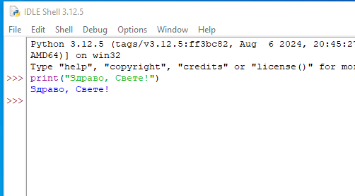
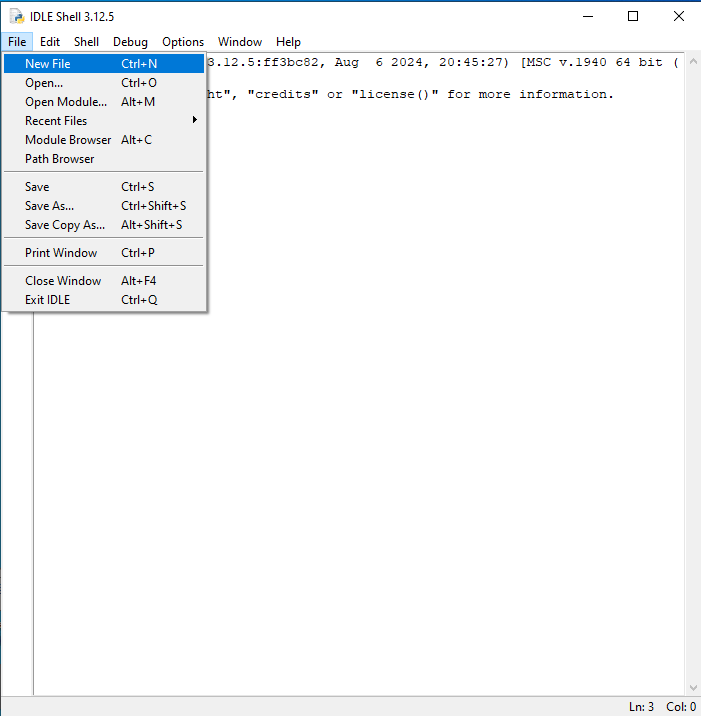
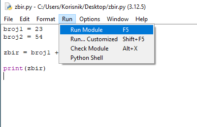
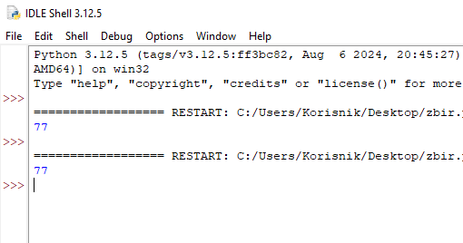
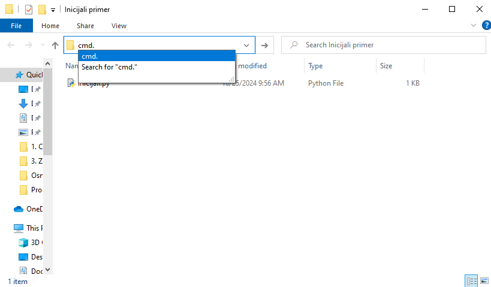
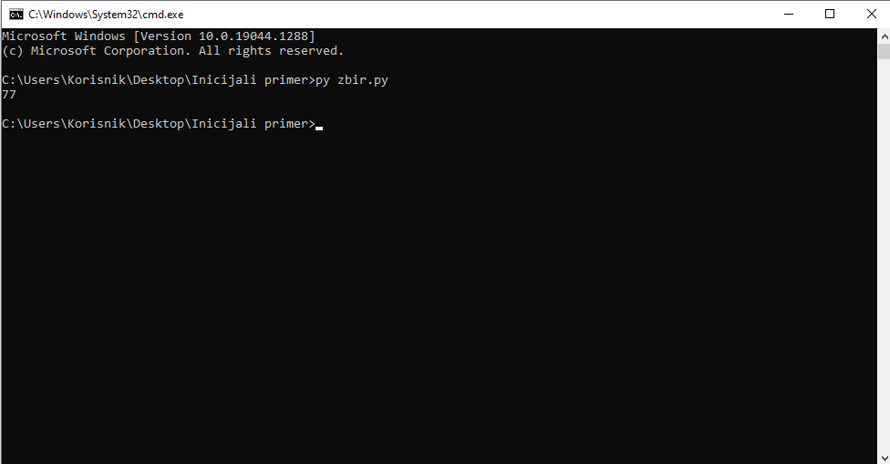
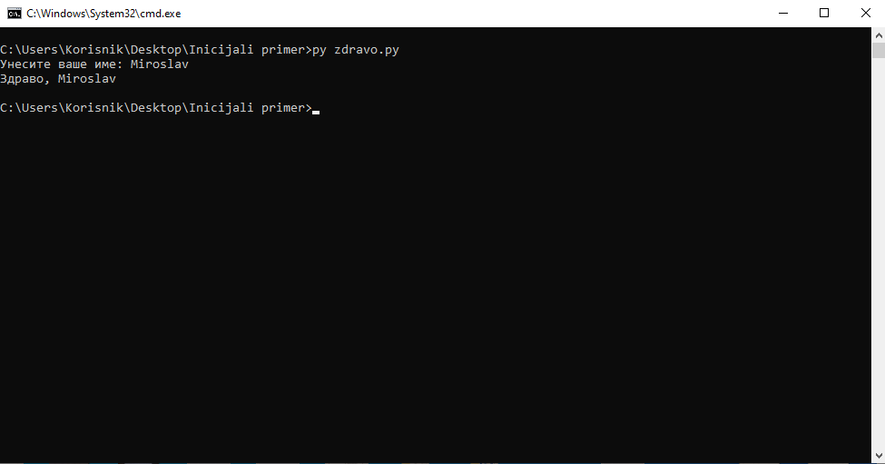

Рад у развојном окружењу IDLE 
==============================

IDLE (Integrated Development and Learning Environment) је основно окружење за развој и учење Пajтона које је инсталирано заједно са Пajтонoм. Ево кратког упутства како да се ради у Python IDLE-у:

1. Након успешне инсталације Пајтона, можете покренути IDLE из менија Start (или на рачунару) тако што ћете га пронаћи као „IDLE (Python [верзија])“, или преко иконице на Десктопу. Када покренете IDLE, отвориће се Shell прозор.

2. У Shell-у можете одмах писати и извршавати једноставне Python команде. На пример:

.. activecode:: input1  
   :coach:
   
   print("Здраво, Светe!")
  
Након што притиснете Enter, IDLE ће одмах извршити команду и приказати резултат.

3. Да бисте креирали нови Python програм, идите на „File“ -> „New File“. Отвориће се нови прозор где можете писати свој кôд. Након што напишете кôд, можете га сачувати као `.py` фајл (нпр. `program.py`).

4. Када завршите са писањем кода, можете га покренути из фајла тако што ћете отићи на „Run“ -> „Run Module“ (или притиском на тастер F5). Ако ваш кôд има грешке, IDLE ће вам показати где је проблем.

.. activecode:: input30  
   :coach:

   broj1 = 23
   broj2 = 54

   zbir = broj1 + broj2

   print(zbir)

  

Откуцан кôд у едитору:

  

Резултат:

5. Можете користити `input()` функцију за унос података од корисника и `print()` функцију за приказивање резултата. На пример:

.. activecode:: input2  
   :coach:
   
   ime = input("Унесите ваше име: ")
   print("Здраво,", ime)

Више о овим функцијама научићете у лекцијама о уносу и испису података. 

.. infonote:: Савети за рад у IDLE-у:

   - **Снимање**: Често снимајте свој фајл да бисте сачували промене.
   - **Препознавање грешака**: IDLE ће вам помоћи са основним информацијама о грешкама и локацији грешке у коду.
   - **Боје кодирања**: IDLE користи различите боје за функције, променљиве и коментаре, што олакшава читање кода.

Рад у конзоли
==================

Конзола је посебно окружење у ком можемо писати команде и добијати резултате од рачунара. Често се користи у програмирању за покретање програма и управљање датотекама. Ево једноставног водича како да почнеш са радом у конзоли:

Како да отвориш конзолу?

.. infonote::

   
   На већини рачунара, конзола је већ инсталирана, а можеш је отворити овако:
   
   - Windows: Притисни `Win + R`, откуцај `cmd` и притисни Enter.
   
   - Mac и Linux: Пронађи и отвори апликацију „Terminal“.
   
 
Отворите фолдер у коме се налази ваш фајл. За пример, ми смо у овом фолдеру сачували  `zbir.py` и `zdravo.py`. У делу путање фајла откуцајте уместо путање команду `cmd.` као на слици: 
 
 

   
   
   
Отвориће вам се конзола и налазићете се на истој локацији у којој сте претходно отворили фолдер. Претходни програм који израчунава збир два броја, сачуван као фајл  `zbir.py`, покрећете командом `py zbir.py`.

Други програм, који исписује поруку која поздравља корисника, сачуван као фајл  `zdravo.py`, покрећете командом `py zdravo.py`.

Када завршиш рад у конзоли, можеш је затворити командом `exit`.
   
   

 