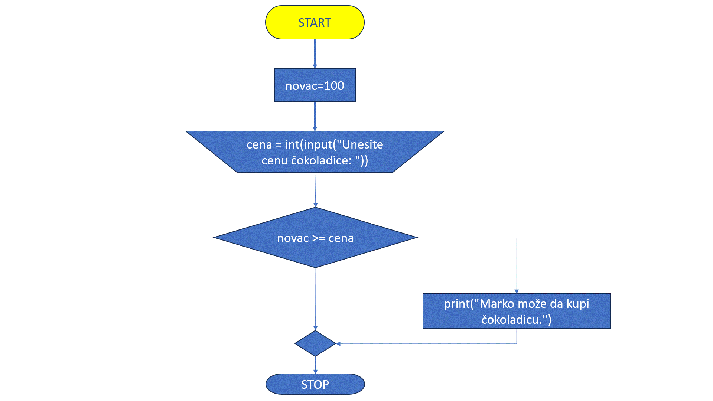

Гранање
=======

Посматрамо следећи проблем:

.. questionnote::

    Марија је кренула у књижару да купи 3 свеске и 4 оловке и понела 500 динара.
    Напиши програм који за унете цене свезака и оловки испитује **да ли је Марија понела довољно новца и ако јесте, колики кусур добија**.

Програм који решава овај проблем треба другачије да се понаша у зависности од тога да ли је Марија понела довољно новца или није.

- **Ако Марија има довољно новца** - исписује добијен кусур
- **Ако Марија нема довољно новца** - исписује да Марија нема довољно новца

У овој лекцији показаћемо како можемо да формирамо овакве програме.


.. technicalnote:: Подсетник: логички изрази


    У прошлој лекцији поменули смо **bool** променљиве које могу да имају само две вредности: ``True`` или ``False`` које представљају **тачно** и **нетачно**.
    Ове вредности се користе у **логичким изразима** који се користе приликом **гранања**. 

    На пример: Израз :math:`3 > 2` има вредност ``True`` (односно **тачно**) јер је 3 веће од 2, док израз :math:`3 < 2` има вредност ``False`` (односно **нетачно**) јер 3 није мање од 2.


    +--------------------+---------------------------+---------------------------------------+
    | **Математика**     | **Пајтон**                | **Значење**                           |
    +====================+===========================+=======================================+
    | :math:`a < b`      | `a<b`                     | a је мање од b                        |
    +--------------------+---------------------------+---------------------------------------+
    | :math:`a > b`      | `a>b`                     | a је веће од b                        |
    +--------------------+---------------------------+---------------------------------------+
    | :math:`a \leq b`   | `a<=b`                    | a је мање или једнако b               |
    +--------------------+---------------------------+---------------------------------------+
    | :math:`a \geq b`   | `a>=b`                    | a је веће или једнако b               |
    +--------------------+---------------------------+---------------------------------------+
    | :math:`a = b`      | `a==b`                    | a је једнако b                        |
    +--------------------+---------------------------+---------------------------------------+
    | :math:`a \neq b`   | `a!=b`                    | a није једнако b                      |
    +--------------------+---------------------------+---------------------------------------+

    Покрени следећи програм и пробај да измениш бројеве и симболе. Посматрај како се вредност израза мења.

    .. activecode:: grananje1
        :coach:

        print(3 > 2)

.. infonote::

    Обрати пажњу да се **=** користи када променљивој **додељујемо** вредност, а да се **==** користи за **поређење** да ли су две вредности једнаке.


Наредба if
-----------

У Пајтону, наредба `if` се користи за условно извршавање делова кода. Када се команда позива, дат је услов који је најчешће логички израз.
Ако је услов тачан, извршава се блок кода који следи иза наредбе `if`. Ако услов није тачан, блок кода се прескаче. Одвајање програма називамо граном. 


Како функционише гранање?
--------------------------

Гранање омогућава да се на основу услова изврши један блок кода, док се други блокови прескачу. Најчешће се користи наредба `if`, која проверава да ли је одређени услов тачан (`True`). Ако јесте, извршава се блок кода који следи; ако није, програм прелази на следећу проверу или наставља извршавање.

Основна структура гранања

Погледајмо пример гранања у Пajтону:

.. activecode:: grananje21
    :coach:

    x = 10

    if x > 5:
        print("x је већи од 5")
    else:
        print("x је мањи или једнак 5")


У овом примеру, програм проверава да ли је `x` већи од 5:

- Ако је услов `True` (тачан), извршава се прва грана и исписује се порука „x је већи од 5”.
- Ако услов није тачан (`False`), програм прелази на другу грану, која исписује „x је мањи или једнак 5”.

Зашто је важно гранање?
-------------------------

**Гранање** је концепт у програмирању који омогућава да програм доноси одлуке на основу одређених услова. Када у коду дођемо до тачке где треба да изаберемо који део програма ће се извршити, програм се „одваја” у различите правце у зависности од испуњености услова. Свако од ових „одвајања” називамо **граном**. Дакле, свака од ових различитих путања или „одвајања” програма, у зависности од услова, назива се **грана**.


Погледајмо и следећи пример: 


.. questionnote::

    Марко је понео 100 динара у продавницу са намером да купи чоколадицу. Цена чоколадице се уноси на стандардни улаз. 
    Ако Марко може да купи чоколадицу, програм треба да испише поруку. Ако Марко не може да купи чоколадицу, програм не треба да испише поруку.


.. activecode:: grananje20
  :coach:

  novac = 100
  cena = int(input("Unesite cenu čokoladice: "))

  if novac >= cena:
      print("Marko može da kupi čokoladicu.")

.. learnmorenote:: Стандардни улаз

    Стандардни улаз је основни начин комуникације између корисника и програма и омогућава прилагођено извршавање кода на основу корисничког уноса.

Кажемо да овај програм садржи **грану**. 

- Уколико је услов тачан, тј. ако је новац који је Марко понео већи или једнак цени чоколадице, извршава се грана унутар `if` наредбе, чиме се исписује порука.
- Ако услов није испуњен, блок кода унутар `if` наредбе се не извршава.

Дијаграм тока овог задатка приказује следећа анимација:





	
У овом програму имамо променљиву `novac` која садржи износ новца који Марко има (у овом случају 100). Програм затим тражи од корисника
да унесе цену чоколадице (`cena`). На основу овога, програм проверава да ли Марко има довољно новца да купи чоколадицу. Ако је услов `novac >= cena` тачан, то значи да је износ новца који Марко има једнак или већи од цене чоколадице. У том случају, програм ће исписати поруку: Марко може да купи чоколадицу.


Ово значи да Марко има довољно новца за куповину чоколадице.

Уколико услов није испуњен, следећи дијаграм тока приказује редослед извршавања наредби и услова:


Наредба *else*
```````````````

Приметићемо да смо у прошлом случају имали само начин да покренемо посебан блок кода ако је услов тачан. 
Шта ако желимо да покренемо други блок кода ако услов није тачан?

У овом случају користићемо `else` наредбу.


.. questionnote::
  Марко је понео 100 динара у продавницу са намером да купи чоколадицу. Цена чоколадице се уноси на стандардни улаз. 
  Ако Марко **може** да купи чоколадицу, програм треба да испише поруку и колики кусур је добио. 
  Ако Марко **не може** да купи чоколадицу, програм треба да испише поруку.

.. activecode:: grananje3
  :coach:

  novac = 100
  cena = int(input("Unesite cenu čokoladice: "))

  if novac >= cena:
      print("Marko može da kupi čokoladicu.")
      kusur = novac - cena
      print("Kusur je:", kusur)
  else:
      print("Марко ne može da kupi čokoladicu")


`else` наредба се користи за покретање блока кода који треба бити извршен ако је услов `if` наредбе неиспуњен. 
Другим речима, програм ће или извршити део кода под `if` блоком, или ће извршити део кода под `else` блоком. 
Ако Марко има довољно новца, покренуће се први блок кода, а ако нема довољно новца покренуће се други блок кода.

.. infonote::

    - Наредба `else` мора да стоји након `if` наредбе, не може стајати сама по себи.
    - Наредба `else` може стајати само једном по `if` наредби. Не може се десити да имамо више `else` наредби за једну `if` наредбу.

.. questionnote::
    
    Написати програм који проверава да ли је број паран.

.. activecode:: grananje40
    :coach:

    broj = int(input("Unesite broj: "))

    if '# DOPUNI':
        print("Broj je paran")
    else:
        print("Broj nije paran")
    

Подсетимо се да је број дељив са неким другим бројем ако је остатак дељења са тим бројем једнак 0. С обзиром да су парни бројеви 
дељиви са 2, онда су парни бројеви они бројеви чији је остатак при дељењу са 2 једнак 0.
  

  
.. questionnote::

    Написати програм који за унети број поена освојен на тесту исписује оцену. 

    - 5 - изнад 85 поена
    - 4 - између 70 и 85 поена
    - 3 - између 55 и 70 поена
    - 2 - између 40 и 55 поена
    - 1 - испод 40 поена


.. code-block:: python

    poeni = int(input("Unesite broj poena: "))

    if poeni > 85:
        print("Ocena 5")
    if poeni >= 70:
        print("Ocena 4")
    if poeni >= 55:
        print("Ocena 3")
    if poeni >= 40:
        print("Ocena 2")
    if poeni < 40:
        print("Ocena 1")

.. mchoice:: grananje_pitanje_1 KOMENTAR: /Стајало је "granjanje_pitanje_1" - molim za proveru da li ima veze sa drugim delovima koda, pa da treba promeniti./
    :answer_a: Да
    :answer_b: Не
    :correct: b

    Да ли ће дати програм исправно радити?

.. questionnote::

    Како можемо поправити претходни програм тако да исправно ради у сваком случају?

Проблем у претходном програму је што ће се исписати тражена оцена и све оцене испод ње. **На пример:** 
ако је број поена 75, исписаће се оцена 4 зато што је :math:`75 > 70` али ће се исписати и оцене 3 и 2 зато што је :math:`75 > 55` и :math:`75 > 40`.

Да бисмо избегли овај проблем, потребно је да осигурамо да се услови након првог испуњеног услова уопште не проверавају. То можемо урадити
користећи `else` наредбу. Написаћемо програм тако да само ако први услов **није испуњен** проверавају се остали, само ако други услов **није испуњен** се проверавају остали итд.
проверавају се остали итд. 

.. code-block:: python

    poeni = int(input("Unesite broj poena: "))

    if poeni > 85:
        print("Ocena 5")
    else:
        if poeni >= 70:
            print("Ocena 4")
    else:
        if poeni >= 55:
            print("Ocena 3")
    else:
        if poeni >= 40:
            print("Ocena 2")
    else:
            print("Ocena 1")


Последњи услов у овом случају не морамо да проверавамо, јер ако број није већи од или једнак 40, онда је сигурно мањи од 40.


Вишеструке гране: `if`, `elif`, и `else`
-----------------------------------------

.. infonote::
  
    У Пајтону се блокови кода одвајају **индентацијом** (размацима који се најчешће формирају коришћењем дугмета **tab**). 
    Уколико желимо да напишемо блок кода који ће се извршити уколико је услов тачан, морамо га увући у односу на `if` наредбу. 
    Сваки блок кода почиње са **двотачком** и наредбом и завршава се када се вратимо на почетну раван.

    Пример:
  
    .. code-block:: python
  
        if uslov:
            # ovaj kod se nalazi unutar if bloka
        #ovaj kod se nalazi van if bloka

    .. code-block:: python
  
        if uslov1:
            # prvi blok koda
            if uslov2:
                # drugi blok koda
            # izlazimo iz drugog bloka koda i nastavljamo izvršavanje prvog bloka koda
        # izlazimo iz prvog bloka koda i nastavljamo glavni blok koda

    Кôд који се налази ван `if` наредбе се увек извршава, док се кôд који се налази унутар `if` наредбе извршава само ако је услов тачан.


Приметимо да се у прошлом раду много пута понавља наредба `else` коју прати наредба `if`. Да бисмо уредили кôд, можемо користити наредбу `elif`. 
Ова наредба се понаша као `else` и `if` у једном. Блок кода који се налази под `elif` наредбом ће се извршити само ако **није испуњен** услов `if` команде 
за коју је `elif` команда везана и ако **јесте** испуњен услов `elif` команде.

Пример: уредићемо претходни кôд користећи `elif` команду.

.. activecode:: grananje6
    :coach:

    poeni = int(input("Unesite broj poena: "))

    if poeni > 85:
        print("Ocena 5")
    elif poeni >= 70:
        print("Ocena 4")
    elif poeni >= 55:
        print("Ocena 3")
    elif poeni >= 40:
        print("Ocena 2")
    else:
        print("Ocena 1")
  
.. infonote::

    Приметимо да команда `else` може регуларно да се користи и надовезује се на `elif` зато што је `elif` команда заправо само скраћени облик прошлог примера.

Логичке вредности добијене овим операторима могу се користити у условним конструкцијама за контролу тока програма.

.. activecode:: grananje7
    :coach: 
   
    x = 15
    y = 20

    if x < y:
        print("x је мањи од y")  # Ова порука ће бити одштампана

    if x == 15:
        print("x је једнако 15")  # Ова порука ће бити одштампана

    if x != y:
        print("x и y нису једнаки")  # Ова порука ће бити одштампана


Оператори за поређење су основни алати за рад с логичким вредностима у Пајтону. 
Они вам омогућавају да проверите односе између вредности и користите те информације за 
контролу тока програма.     
  

Кориснички унос са провером
----------------------------


Важно је осигурати да корисник унесе исправне податке. Уколико се очекује број, треба проверити да ли је унесена вредност валидна пре него што наставите са програмом.
Пример: Провера да ли је унет цео број

.. activecode:: unos5
    :coach:

    unet_broj = input("Унесите цео број: ")

    if unet_broj.isdigit():
        broj = int(unet_broj)
        print(f"Унели сте број: {broj}")
    else:
        print("Морате унети цео број.")

Рад са различитим типовима уноса
-------------------------------------

Корисник може унети различите типове података, а ви можете контролисати унос и обраду зависно од потреба програма.


Пример: Унос имена и година

.. activecode:: unos6
    :coach:

    ime = input("Унесите ваше име: ")
    godine = input("Колико имате година? ")

    if godine.isdigit():
        print(f"Здраво, {ime}. Имаш {godine} година.")
        
    else: 
        print("Године морају бити цео број.")

Функција isdigit() је корисна јер спречава грешке када је потребно да корисник унесе само бројеве. Уместо да програм настави са неважећим уносом, isdigit() осигурава да 
корисник уноси исправан формат пре него што програм настави са извршавањем.

.. learnmorenote:: Шта тачно ради функција isdigit()?

    Функција **isdigit()** проверава да ли се уносе само бројеви. Ако unet_broj садржи само бројеве (цифре од 0 до 9), isdigit() ће вратити True, што значи да је унос исправан, 
    и програм ће исписати поруку „Унели сте број:”, праћену тим бројем. Ако unet_broj садржи било који знак који није број (на пример, слова или специјалне знакове), isdigit() 
    ће вратити False, и тада ће програм приказати поруку „Морате унети цео број.”

    Објашњење корак по корак:

    - unet_broj = input("Унесите цео број: "):  Програм користи input() да би добио унос од корисника и чува га у променљивој unet_broj као текст.

    - if unet_broj.isdigit(): Овде isdigit() проверава да ли unet_broj садржи само цифре. Ако садржи, услов ће бити тачан (True).

    - Ако је услов тачан (True): Програм исписује поруку „Унели сте број:”, и исписује унети број.

    - Ако је услов нетачан (False): Програм приказује поруку „Морате унети цео број.”, што означава да је унос био неважећи.


Примена у реалним сценаријима
--------------------------------

Гранање и кориснички унос података које сте до сада видели могу се користити у различитим апликацијама. На пример, можете направити мини-калкулатор који узима два броја и операцију од корисника, затим извршава операцију и враћа резултат кориснику. 

.. activecode:: unos7
   :coach:

   broj_1 = float(input("Унесите први број: "))
   broj_2 = float(input("Унесите други број: "))
   operacija = input("Изаберите операцију (+, -, *, /): ")

   if operacija == "+":
       rezultat = broj_1 + broj_2
   elif operacija == "-":
       rezultat = broj_1 - broj_2
   elif operacija == "*":
       rezultat = broj_1 * broj_2
   elif operacija == "/":
       rezultat = broj_1 / broj_2
   else:
       rezultat = "Непозната операција!"

   print("Резултат :", rezultat)


.. infonote:: Кључне тачке

    - **Гране** су различите путање у програму које зависе од услова.
    - Гранање омогућава да програм изврши различите делове кода на основу одлука.
    - Овакво одвајање програма у различите правце чини га флексибилнијим и прилагодљивим у различитим ситуацијама.
