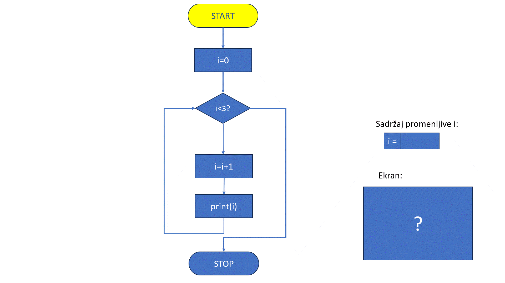
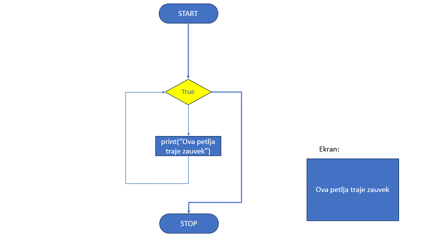
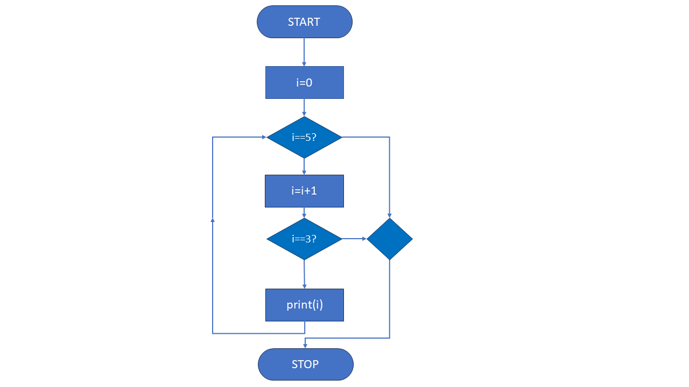
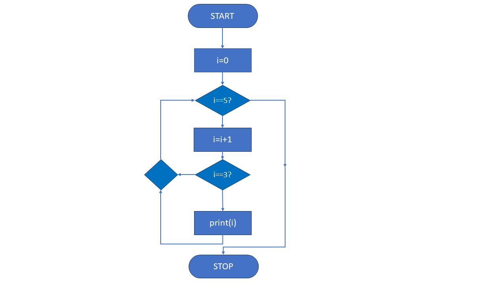
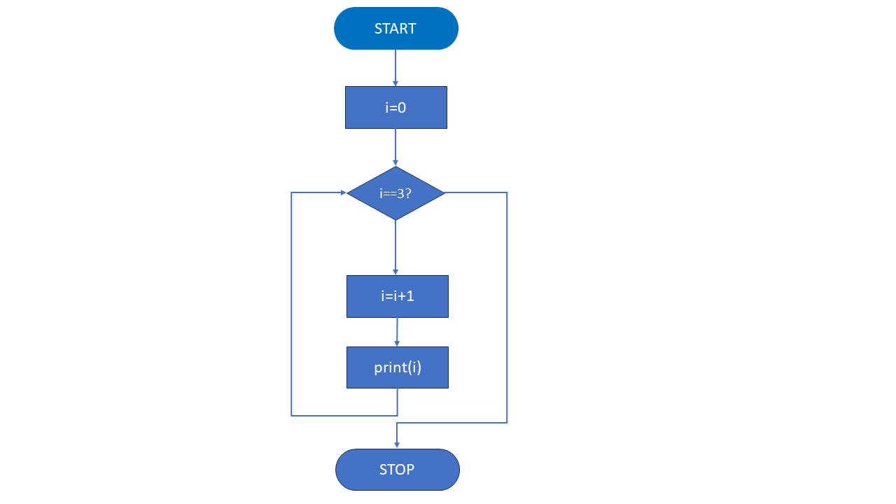

While петља
============


У Пајтону, `while` петља се користи када желимо да понављамо одређени блок кода док неки услов остаје тачан. 
Ова петља ће наставити да извршава кôд све док је услов `True`. Када услов постане `False`, петља се прекида и 
прелази се на остатак програма.

Основна синтакса:

.. code-block:: python

   while услов:  
       # кôд који се извршава док је услов тачан


`Услов` је логички израз који се проверава пре сваког проласка кроз петљу. Петља ће се наставити све док је вредност услова 
`True`. Када услов постане `False`, извршавање петље се прекида, и програм наставља са наредбом која долази након петље. 
Ова провера услова омогућава да петља ради само док су испуњени одређени услови, што је важно за контролу понављања и 
спречавање бесконачног извршавања кода.

Пример 1: Једноставна while петља
`````````````````````````````````


.. activecode:: while2  
   :coach:

   i = 0  
   while i < 3:  
       i = i + 1
       print(i)  
	   
Овај кôд је `while` петља која повећава вредност променљиве `i` и исписује је на екран све док је `i` мање од `3`. Ево детаљног објашњења сваког дела:

1. **i = 0**

   - Кôд почиње иницијализацијом променљиве `i` на вредност `0`. Ова променљива служи као бројач који прати пролазе кроз петљу.

2. **while i < 3:**
   
   - Овим редом почиње `while` петља која ће се извршавати све док је услов `i < 3` тачан.
   - У почетку је `i = 0`, што задовољава услов, па се петља извршава.
   - Петља ће се наставити све док `i` не постане једнако `3` или веће од `3`.

3. **i = i + 1**

   - Унутар петље, променљива `i` се повећава за `1` у сваком проласку. Ово омогућава да се `i` мења, приближавајући се услову за завршетак петље.
   - Вредности `i` ће бити `1`, `2`, и `3` током пролаза кроз петљу.

4. **print(i)**

   - Након што се `i` увећа, ова наредба исписује тренутну вредност `i`.
   - У сваком пролазу петље биће исписана нова вредност `i`, која се повећала за `1`.

5. **Излаз** - овај кôд ће исписати следеће вредности:

.. code-block:: 

    1
    2
    3


.. infonote:: Резиме 

    - Променљива `i` почиње са вредношћу `0`.

    - Петља се извршава све док је `i < 3`.

    - У сваком проласку, `i` се увећава за `1` и нова вредност се исписује.

    - Када `i` постане `3`, услов `i < 3` више није тачан, па се петља прекида.
    
    Тако овај кôд исписује бројеве `1`, `2`, и `3`.


Погледај следећу анимацију: 




Пример 2: Бесконачна while петља
`````````````````````````````````

Бесконачна `while` петља је петља која се извршава непрекидно јер услов за заустављање никада није испуњен. 
У најједноставнијем облику, користи `while True`, што значи да је услов за понављање увек тачан. Ова петља ће се
извршавати све док је ручно не прекинемо, било прекидом програма или наредбом `break` унутар саме петље.
На пример, петља која непрестано исписује текст или ради неки задатак може се сматрати бесконачном ако нема
механизам за излазак. Овакав тип петље користи се у програмима који треба да раде све док не добију одређени 
сигнал или услов за заустављање.


.. code-block:: python
   

   while True:  
       print("Ova petlja traje zauvek!")




**Напомена**: Да би се зауставила оваква петља, користимо неку форму прекида, попут наредбе `break`.


Пример 3: Коришћење break у while петљи
```````````````````````````````````````

Наредба `break` у `while` петљи омогућава да се петља прекине раније, чак и ако услов за наставак још увек важи. 
Ово значи да, када програм наиђе на `break`, одмах излази из петље и наставља са извршавањем кода који долази након ње. 
`break` је користан када желимо да зауставимо петљу на основу додатног услова који није део основног услова петље. 
Ово омогућава већу контролу над извршавањем програма и прекид петље у тачно одређеним ситуацијама.

.. activecode:: while4  
   :coach:

   i = 1  
   while True:  
       if i == 3:  
           break  
       i = i + 1
       print(i)




Ова петља би теоретски трајала заувек, али када променљива `i` постане 3, `break` наредба прекида петљу.

Пример 4: Коришћење `continue` у `while` петљи
```````````````````````````````````````````````

Наредба `continue` унутар петље омогућава да се остатак кода у тренутном проласку прескочи и одмах пређе на следећи пролазак кроз петљу.
Када програм наиђе на `continue`, све наредбе након ње у тој итерацији се занемарују, а петља наставља из почетка са следећим понављањем. 
Ово је корисно када желимо да се у специфичним ситуацијама прескоче одређени делови кода, али да петља и даље настави да се извршава.

.. activecode:: while5  
   :coach:

   i = 0  
   while i < 5:   
       i = i + 1  
       if i == 3:  
           continue  
       print(i)



Када `i` постане 3, `continue` прескаче ту итерацију, па се број 3 не исписује.

Пример 5: `while` петља са `else` блоком
````````````````````````````````````````

Блок `else` уз `while` петљу извршава се само ако петља заврши на уобичајен начин, када услов у `while` петљи постане лажан, а не услед наредбе `break`. 
Ако се `break` наредба користи за прекид петље, блок `else` ће бити прескочен и неће се извршити. Овај механизам је користан када је потребно извршити неки задатак тек након што петља прође све своје итерације. На пример, може послужити за приказ поруке
која потврђује да је петља завршена без прекида или за извршавање радњи које су релевантне само у случајевима када се петља заврши потпуно.


.. activecode:: while6    
   :coach:

   i = 1  
   while i <= 3:  
       print(i)  
       i = i + 1  
   else:  
       print("Петља је завршена!")




.. infonote:: Кључне ствари које треба запамтити:  

    - `while` петља се извршава све док је услов тачан.  

    - Користите `break` за превремени излаз из петље.  

    - `continue` се користи за прескакање тренутног проласка и прелазак на следећи.  

    - Петља са `else` блоком омогућава додатну радњу након завршетка петље.

    `While` петље су корисне када не знамо тачно колико пута треба да поновимо радњу, већ се ослањамо на неки услов који контролише извршавање петље.
