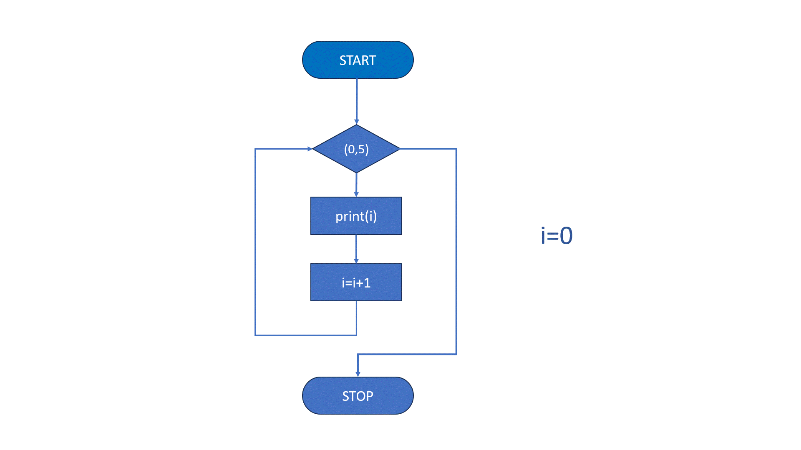

For петља
===========

Да бисмо разумели појам *петље* и *бројача*, кренимо од основа.

**Шта је петља?**

*Петља* је програмска структура која омогућава понављање једног или више корака (инструкција) све док је испуњен одређени услов. Уместо да исти код пишемо више пута, користимо петље да би рачунар аутоматски понављао инструкције и тиме постигао ефикасност.

Постоји више врста петљи, али најчешћa je **for петља:** која се користи када знамо колико пута треба да поновимо инструкцију
   
   
**Шта је бројач?**

*Бројач* је променљива која се користи унутар петље за праћење броја итерација или за промену вредности у свакој итерацији. Он се најчешће користи у
*for* петљи као индикатор колико пута је петља прошла, или као нека врста мерача који управља радом програма.

Како бројач мења вредност при свакој итерацији?

Бројач обично започиње од неке почетне вредности и сваким проласком кроз петљу мења своју вредност. Ево примера са *for* петљом у Python-у, 
где бројач мења вредност за `1` у свакој итерацији:

.. activecode:: for111  
   :coach:

   for i in range(5):
       print("Вредност бројача је:", i)

.. infonote:: У овом примеру:

   - **i** је бројач.
   
   - `range(5)` дефинише да петља ради пет пута, при чему **i** иде од `0` до `4`
   
   - На сваком пролазу кроз петљу, `i` се увећава за `1` (по подразумеваној вредности), што омогућава да свака итерација има другачију вредност бројача

   **Свака итерација мења вредност бројача, што омогућава да се услови у петљи прилагођавају и динамички управљају извршавањем програма.**

**For петља** је структура у програмирању која се користи за понављање одређеног блока кода више пута, све док је одређени услов задовољен. 
Ова петља се обично користи када је познат број понављања унапред.

Синтакса for петље у програмским језицима обично изгледа овако:

.. activecode:: for0  
   :coach:

   for i in range(početna vrednost; uslov; korak):
   
       // Блок кода који се понавља
   

Елементи for петље:

1. **Почетна вредност** – Иницијализује почетну вредност бројача.
2. **Услов** – Проверава се на почетку сваке итерације. Ако је услов испуњен, петља се извршава; ако није, излазимо из петље.
3. **Корак** – Одређује како се бројач мења након сваке итерације.

**Пример 1 у Python-у:**

.. activecode:: for  
   :coach:

   for i in range(5):
       print(i)

  
  

Овај код ће исписати бројеве од 0 до 4.

Функција `range()` у Пајтону генерише низ бројева и често се користи са `for` петљом када је потребно поновити радњу одређени број 
пута или проћи кроз бројевни интервал.

**Пример 2:  Испишимо бројеве од 0 до 4**

Користићемо `range(5)` у комбинацији са `for` петљом:

.. activecode:: for4   
   :coach:
   
   for i in range(5):
       print(i)

Објашњење:
1. `range(5)` генерише низ бројева од 0 до 4 (5 није укључено).
2. `for i in range(5):` - `for` петља ће пролазити кроз сваки број у овом низу, и променљива `i` ће узимати вредности од 0 до 4.
3. `print(i)` - Сваки број који `i` узме биће исписан.

Резултат исписа:

.. code-block::
   
   0
   1
   2
   3
   4

Напомена:
Функција `range()` има и додатне параметре. На пример, можете задати почетну вредност, крајњу вредност и корак:

.. activecode:: for5  
   :coach:

   for i in range(2, 10, 2):
       print(i)

Овај код ће исписати бројеве од 2 до 8 са кораком 2:

.. code-block::
   
   2
   4
   6
   8

Коришћењем `range()` функције омогућавамо `for` петљи да лако обради одређени низ бројева, што је посебно корисно када треба 
да поновимо радњу фиксни број пута или када желимо бројеве у одређеном опсегу.

Овде `range(5)` генерише бројеве од 0 до 4 (не укључујући 5).

**Пример 3: Коришћење `range(start, stop, step)`**

Функција `range()` може имати до три параметра:  

- start (почетна вредност),  
- stop (крајња вредност, али не укључена),  
- step (корак, односно интервал).

.. activecode:: for6  
   :coach:

   for broj in range(2, 10, 2):  
      print(broj)

**Пример 4: Угнежђена `for` петља**

Можете имати једну `for` петљу унутар друге. Угнежђена `for` петља подразумева да се једна `for` петља налази унутар друге. 
Ово је корисно када желимо да обрадимо податке у два или више димензија, попут обраде табеле, матрице или прављења комбинација 
елемената из два скупа.

**Пример 5: `for` петља и `else`**

`else` блок може бити коришћен са `for` петљом. Он ће се извршити када се заврши петља, осим ако није дошло до прекида `break` наредбом.

.. activecode:: for8  
   :coach:

   for broj in range(3):  
      print(broj)  
   else:  
      print("Петља је завршена!")

.. infonote:: Кључне ствари које треба запамтити:  

   - `for` петља у Пајтону служи за понављање кроз елементе неке колекције или интервала.  
   - Може се комбиновати са `range()` функцијом за генерисање низа бројева.  
   - Може се користити `else` блок за додатне радње након завршетка петље.

   `For` петље су моћан начин за обраду података у Пајтону, посебно када треба да прођете кроз велике количине података на ефикасан начин.